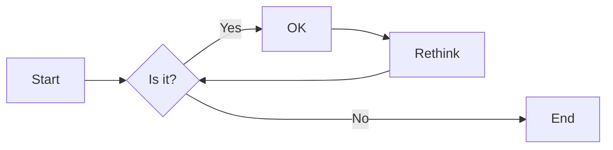
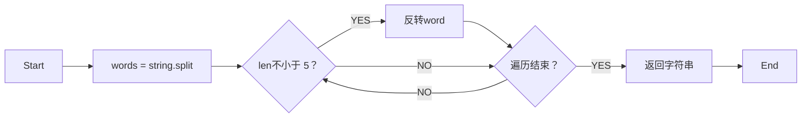
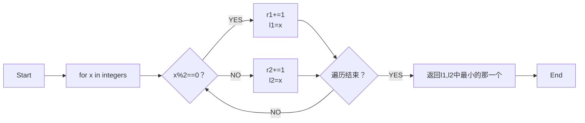
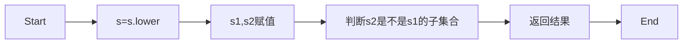

# 实验五 Python数据结构与数据模型

班级： 21计科1

学号：B20210302101

姓名： 金库

Github地址：<https://gitee.com/jinku111/jinku111.git>

CodeWars地址：<https://www.codewars.com/users/Jinku123>

---

## 实验目的

1. 学习Python数据结构的高级用法
2. 学习Python的数据模型

## 实验环境

1. Git
2. Python 3.10
3. VSCode
4. VSCode插件

## 实验内容和步骤

### 第一部分

在[Codewars网站](https://www.codewars.com)注册账号，完成下列Kata挑战：

---

#### 第一题：停止逆转我的单词

难度： 6kyu

编写一个函数，接收一个或多个单词的字符串，并返回相同的字符串，但所有5个或更多的字母单词都是相反的（就像这个Kata的名字一样）。传入的字符串将只由字母和空格组成。只有当出现一个以上的单词时，才会包括空格。
例如：

```python
spinWords( "Hey fellow warriors" ) => returns "Hey wollef sroirraw" 
spinWords( "This is a test") => returns "This is a test" 
spinWords( "This is another test" )=> returns "This is rehtona test"
```

代码提交地址：
<https://www.codewars.com/kata/5264d2b162488dc400000001>

提示：

- 利用str的split方法可以将字符串分为单词列表
例如：

```python
words = "hey fellow warrior".split()
# words should be ['hey', 'fellow', 'warrior']
```

- 利用列表推导将长度大于等于5的单词反转(利用切片word[::-1])
- 最后使用str的join方法连结列表中的单词。

---

#### 第二题： 发现离群的数(Find The Parity Outlier)

难度：6kyu

给你一个包含整数的数组（其长度至少为3，但可能非常大）。该数组要么完全由奇数组成，要么完全由偶数组成，除了一个整数N。请写一个方法，以该数组为参数，返回这个 "离群 "的N。

例如：

```python
[2, 4, 0, 100, 4, 11, 2602, 36]
# Should return: 11 (the only odd number)

[160, 3, 1719, 19, 11, 13, -21]
# Should return: 160 (the only even number)
```

代码提交地址：
<https://www.codewars.com/kata/5526fc09a1bbd946250002dc>

---

#### 第三题： 检测Pangram

难度：6kyu

pangram是一个至少包含每个字母一次的句子。例如，"The quick brown fox jumps over the lazy dog "这个句子就是一个pangram，因为它至少使用了一次字母A-Z（大小写不相关）。

给定一个字符串，检测它是否是一个pangram。如果是则返回`True`，如果不是则返回`False`。忽略数字和标点符号。
代码提交地址：
<https://www.codewars.com/kata/545cedaa9943f7fe7b000048>

---

#### 第四题： 数独解决方案验证

难度：6kyu

数独背景

数独是一种在 9x9 网格上进行的游戏。游戏的目标是用 1 到 9 的数字填充网格的所有单元格，以便每一列、每一行和九个 3x3 子网格（也称为块）中的都包含数字 1 到 9。更多信息请访问：<http://en.wikipedia.org/wiki/Sudoku>

编写一个函数接受一个代表数独板的二维数组，如果它是一个有效的解决方案则返回 true，否则返回 false。数独板的单元格也可能包含 0，这将代表空单元格。包含一个或多个零的棋盘被认为是无效的解决方案。棋盘总是 9 x 9 格，每个格只包含 0 到 9 之间的整数。

代码提交地址：
<https://www.codewars.com/kata/63d1bac72de941033dbf87ae>

---

#### 第五题： 疯狂的彩色三角形

难度： 2kyu

一个彩色的三角形是由一排颜色组成的，每一排都是红色、绿色或蓝色。连续的几行，每一行都比上一行少一种颜色，是通过考虑前一行中的两个相接触的颜色而产生的。如果这些颜色是相同的，那么新的一行就使用相同的颜色。如果它们不同，则在新的一行中使用缺失的颜色。这个过程一直持续到最后一行，只有一种颜色被生成。

例如：
```python
Colour here:            G G        B G        R G        B R
Becomes colour here:     G          R          B          G
```


一个更大的三角形例子：

```python
R R G B R G B B
 R B R G B R B
  G G B R G G
   G R G B G
    B B R R
     B G R
      R B
       G
```

你将得到三角形的第一行字符串，你的工作是返回最后的颜色，这将出现在最下面一行的字符串。在上面的例子中，你将得到 "RRGBRGBB"，你应该返回 "G"。
限制条件： 1 <= length(row) <= 10 ** 5
输入的字符串将只包含大写字母'B'、'G'或'R'。

例如：

```python
triangle('B') == 'B'
triangle('GB') == 'R'
triangle('RRR') == 'R'
triangle('RGBG') == 'B'
triangle('RBRGBRB') == 'G'
triangle('RBRGBRBGGRRRBGBBBGG') == 'G'
```

代码提交地址：
<https://www.codewars.com/kata/5a331ea7ee1aae8f24000175>

提示：请参考下面的链接，利用三进制的特点来进行计算。
<https://stackoverflow.com/questions/53585022/three-colors-triangles>

---

### 第二部分

使用Mermaid绘制程序流程图

安装VSCode插件：

- Markdown Preview Mermaid Support
- Mermaid Markdown Syntax Highlighting

使用Markdown语法绘制你的程序绘制程序流程图（至少一个），Markdown代码如下：


显示效果如下：



查看Mermaid流程图语法-->[点击这里](https://mermaid.js.org/syntax/flowchart.html)

使用Markdown编辑器（例如VScode）编写本次实验的实验报告，包括[实验过程与结果](#实验过程与结果)、[实验考查](#实验考查)和[实验总结](#实验总结)，并将其导出为 **PDF格式** 来提交。

## 实验过程与结果

请将实验过程与结果放在这里，包括：

- [第一部分 Codewars Kata挑战](#第一部分)


```python
def spin_words(string):    #第一题
    words = string.split()
    reversed_words = [word[::-1] if len(word) >= 5 else word for word in words]
    return ' '.join(reversed_words)
```

```python
def find_outlier(integers):   #第二题
    r1,r2,l1,l2=0,0,0,0;
    for x in integers:
        if  x%2==0:
            r1+=1
            l1=x
        else : 
            r2+=1
            l2=x
    if r1>r2: return l2
    else: return l1
```

```python
def is_pangram(s):   #第三题
    s=s.lower()
    s1=set(s)  //放到集合里
    s2=set('abcdefghijklmnopqrstuvwxyz') //放到集合里
    return s2.issubset(s1)  //判断s2是不是s1的子集合
```

```python
def validate_sudoku(board):   #第四题
    # 检查每一行
    for row in board:
        if not is_valid_row(row):
            return False
    
    # 检查每一列
    for col in range(9):
        column = [board[row][col] for row in range(9)]
        if not is_valid_row(column):
            return False
    
    # 检查每一个3x3子网格
    for i in range(0, 9, 3):
        for j in range(0, 9, 3):
            square = [board[row][col] for row in range(i, i+3) for col in range(j, j+3)]
            if not is_valid_row(square):
                return False
    
    return True

def is_valid_row(row):
    # 检查是否有重复数字，除了0
    seen = set()
    for num in row:
        if num != 0 and num in seen or (num==0):
            return False
        seen.add(num)
    return True
```

```python
def triangle(row):  #第五题
    reduce=[3**i+1 for i in range(10) if 3**i<=100000][::-1]
    
    COLOR = {'GG':'G', 'BB':'B', 'RR':'R', 'BR':'G', 
            'BG':'R', 'GB':'R', 'GR':'B', 'RG':'B', 'RB':'G'}

    for length in reduce:
        while len(row)>=length:
            row=[ COLOR[row[i] + row[i+length-1]] for i in range(len(row)-length+1)]
    return row[0]
```
- [第二部分 使用Mermaid绘制程序流程图](#第二部分)










## 实验考查

请使用自己的语言并使用尽量简短代码示例回答下面的问题，这些问题将在实验检查时用于提问和答辩以及实际的操作。

1. 集合（set）类型有什么特点？它和列表（list）类型有什么区别？

   set:元素无序且唯一;
   list：元素按照添加的顺序且元素唯一;

2. 集合（set）类型主要有那些操作？
  set()或{}来创建一个空集合，add来添加元素；remove()删除元素，issubset(other_set)，issubset(other_set)子集和超集。in判断是否在集合中。


3. 使用`*`操作符作用到列表上会产生什么效果？为什么不能使用`*`操作符作用到嵌套的列表上？使用简单的代码示例说明。

   ```python
    nested_list = [[1, 2], [3, 4]]
   duplicated_list = nested_list * 2

   print(nested_list)        # 输出: [[1, 2], [3, 4]]
   print(duplicated_list)    # 输出: [[1, 2], [3, 4], [1, 2], [3, 4]]

   nested_list[0][0] = 0
   print(nested_list)        # 输出: [[0, 2], [3, 4]]
   print(duplicated_list)    # 输出: [[0, 2], [3, 4], [0, 2], [3, 4]]
   ```

4. 总结列表,集合，字典的解析（comprehension）的使用方法。使用简单的代码示例说明。


    列表解析,基本语法是 [expression for item in iterable if condition]，其中 expression 是对每个 item 的操作，iterable 是可迭代对象，if condition 是一个可选的条件表达式。

    下面是一个简单的示例，使用列表解析来创建一个包含 1 到 10 的平方的列表：
   ```python
   squares = [x**2 for x in range(1, 11)]
   print(squares)  # 输出: [1, 4, 9, 16, 25, 36, 49, 64, 81, 100]
   ```
      集合解析（Set comprehension）与列表解析类似，只是使用大括号 {} 来表示集合。它的基本语法是 {expression for item in iterable if condition}。下面是一个示例，使用集合解析来创建一个包含 1 到 10 的平方的集合：
   ```python
   squares = {x**2 for x in range(1, 11)}
   print(squares)  # 输出: {64, 1, 4, 36, 100, 9, 16, 49, 81, 25}
   ```

    字典解析（Dictionary comprehension）也类似，使用大括号 {} 和冒号 : 来表示键值对。
    
    ```python
    squares = {x: x**2 for x in range(1, 6)}
    print(squares)  # 输出: {1: 1, 2: 4, 3: 9, 4: 16, 5: 25}
    ```


## 实验总结

总结一下这次实验你学习和使用到的知识，例如：编程工具的使用、数据结构、程序语言的语法、算法、编程技巧、编程思想。

 通过本次实验学会了list，set的使用，以及一些方法。对set和list操作的方法更加熟练，明晰了两者之间的异同，学会了列表,集合，字典的解析的使用方法。以及`*`操作符作用到列表上的作用和效果
。
